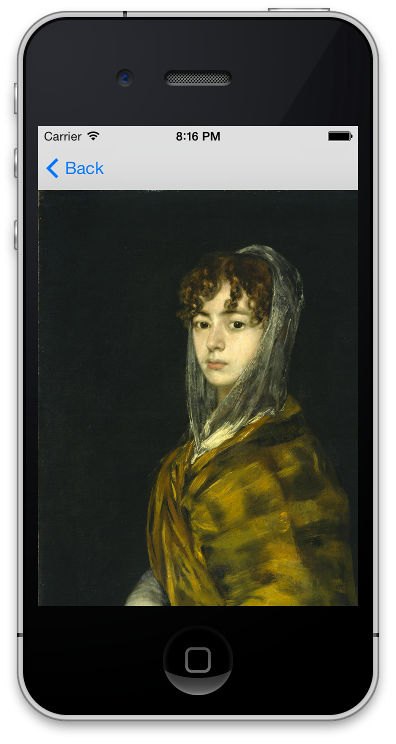
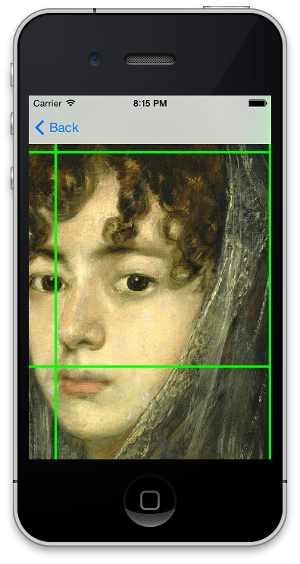

# ARTiledImageView

[](https://travis-ci.org/dblock/ARTiledImageView)
[](http://cocoadocs.org/docsets/ARTiledImage)
[](http://cocoadocs.org/docsets/ARTiledImage)

## Demo




[Francisco De Goya Y Lucientes, Señora Sabasa Garcia, ca. 1806/1811](https://artsy.net/artwork/francisco-jose-de-goya-y-lucientes-senora-sabasa-garcia), courtesy of the National Gallery of Art, Washington D.C., via [Artsy](https://artsy.net).

## Usage

``` objc
ARWebTiledImageDataSource *ds = [[ARWebTiledImageDataSource alloc] init];
// height of the full zoomed in image
ds.maxTiledHeight = 2933;
// width of the full zommed in image
ds.maxTiledWidth = 2383;
// width of the full zommed in image
ds.minTileLevel = 10;
// maximum tile level
ds.maxTileLevel = 15;
// side of a square tile
ds.tileSize = 512;
// tile format
ds.tileFormat = @"jpg";
// location of tiles, organized in subfolders, one per level
ds.tileBaseURL = [NSURL URLWithString:@"https://raw.github.com/dblock/ARTiledImageView/master/Demo/Tiles/SenoraSabasaGarcia/tiles"];

ARTiledImageScrollView *v = [[ARTiledImageScrollView alloc] initWithFrame:self.view.bounds];
// set datasource
v.dataSource = ds;
// default background color
v.backgroundColor = [UIColor grayColor];
// default stretched placeholder image
v.backgroundImageURL = [NSURL URLWithString:@"https://raw.github.com/dblock/ARTiledImageView/master/Demo/Tiles/SenoraSabasaGarcia/large.jpg"];
// display tile borders, for debugging
v.displayTileBorders = NO;

// add as a subview to another view
[self.view addSubview:v];
```

## Installation

ARTiledImageView is available through [CocoaPods](http://cocoapods.org), to install it simply add the following line to your Podfile:

    pod "ARTiledImageView"

## Credits

ARTiledImageView was written by [@orta](https://github.com/orta), with contributions from [@speednoisemovement](https://github.com/speednoisemovement) and [@dblock](https://github.com/dblock).

## Copyright & License

ARTiledImageView is (c) [Artsy Inc.](http://artsy.net), available under the MIT license.

See the [LICENSE](LICENSE) file for more information.


